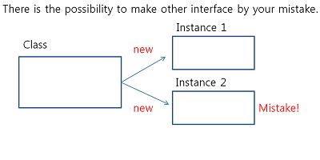
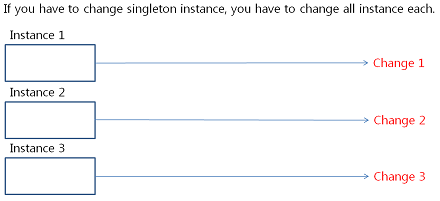
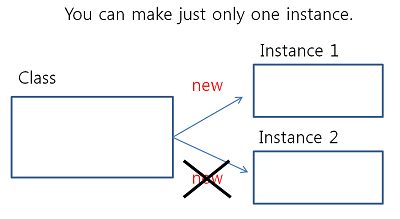
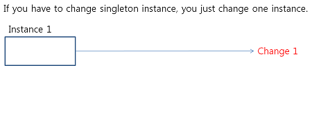

# DesignPattern

## What is Design Pattern?
> Design patterns represent the **best practices** used by experienced object-oriented software developers. Design patterns are **solutions** to general problems that software developers faced during software development. These solutions were obtained by trial and error by numerous software developers over quite a substantial period of time.

> Reference - https://www.tutorialspoint.com/design_pattern/design_pattern_overview.htm
> ###What is best practices?
>> A best practice is a technique or methodology that, through experience and research, has proven to reliably lead to a desired result.

>> Reference - http://searchsoftwarequality.techtarget.com/definition/best-practice

## Design Pattern Principle
>1. Divide the part that needs to change and the part that needs not to change.
>2. Do programming focus on supertype rather than implement. (For Polymorphism)
>3. Use composition than extend.

***

### 1. Strategy Pattern
####1) What is Strategy Pattern? (Keyword: Selection)
The strategy pattern (also known as the policy pattern) is a behavioural software design pattern that enables **an algorithm's behavior to be selected at runtime**.

### 2. Adapter Pattern
####1) What is Adapter Pattern? (Keyword: Existing class, Reuse)
The adapter pattern is a software design pattern (also known as Wrapper, an alternative naming shared with the Decorator pattern) that allows the interface of **an existing class to be used as another interface**. It is often used to make existing classes work with others **without modifying their source code**.

### 3. Template Pattern
####1) What is Template Pattern? (Keyword: Skeleton, Redefine certain steps)
The template method pattern is a behavioral design pattern that defines the program skeleton of an algorithm in an operation, deferring some steps to subclasses. It lets one **redefine certain steps of an algorithm without changing the algorithm's structure**.

### 4. Decorator Pattern
####1) What is Decorator Pattern? (Keyword: Addition)
The decorator pattern (also known as Wrapper, an alternative naming shared with the Adapter pattern) is a design pattern that allows behavior **to be added to an individual object, either statically or dynamically, without affecting the behavior of other objects from the same class**. The decorator pattern is often useful for adhering to the Single Responsibility Principle, as it allows functionality to be divided between classes with unique areas of concern

### 5. Composite Pattern
####1) What is Composite Pattern? (Keyword: Same way)
The composite pattern is a partitioning design pattern. The composite pattern describes that a group of objects is to **be treated in the same way as a single instance of an object**. The intent of a composite is to "compose" objects into tree structures to represent **part-whole hierarchies**. Implementing the composite pattern lets clients treat individual objects and compositions uniformly

### 6. Singleton Pattern
####1) What is Singleton Pattern? (Keyword: restriction, only one)
The singleton pattern is a software design pattern that **restricts the instantiation of a class to one object**. This is useful when exactly one object is needed to coordinate actions across the system. The concept is sometimes generalized to systems that operate more efficiently **when only one object exists**, or that restrict the instantiation to a certain number of objects. The term comes from the mathematical concept of a singleton.

####2) Background

       

####3) Benefit

       

####4) Example
[Singleton Pattern 1](./[Basic]SingleTonPattern)
[Singleton Pattern 2](./[Pro]SingleTonPattern)

### 7. Facade Pattern
####1) What is Fasade Pattern? (Keyword: simple interface)
The Facade design pattern is often used when a system is very complex or difficult to understand because the system has a large number of interdependent classes or its source code is unavailable. This pattern hides the complexities of the larger system and provides **a simpler interface to the client**.
